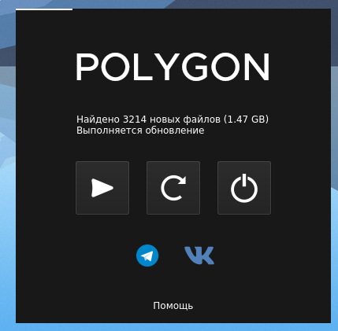

# Polygon Launcher

Launcher for polygon online project, implemented with awesome [nodegui](https://github.com/nodegui/nodegui) project

[Download installer from releases tab](https://github.com/Solant/polygon-launcher/releases)

# Troubleshooting
Q: Мигает консолька и все :(

A: Обнови Microsoft Visual C++ redistributable [тут](https://support.microsoft.com/ru-ru/help/2977003/the-latest-supported-visual-c-downloads)

Q: Все скачал, нажимаю играть, а не играет :(

A: Перед запуском должен быть запущен стим, причем без прав администратора
